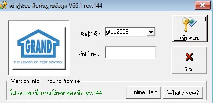
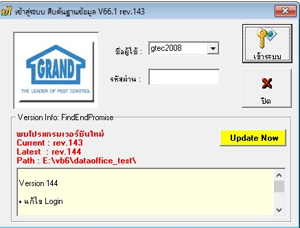
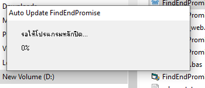
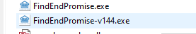
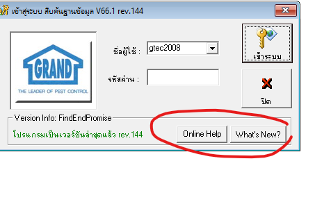

# Release Notes

ยินดีต้อนรับสู่ **Release Notes** ของโปรแกรม **FindEndPromise**

หน้านี้ใช้สำหรับสรุปสิ่งที่เปลี่ยนแปลงในแต่ละ Revision เพื่อให้ผู้ใช้งานทราบว่ามีอะไรใหม่ก่อนทำการอัปเดต

---

# Revision 141 {#rev141}

**Release Date:** 30 มิถุนายน 2569

## 🎉 Highlight

เปิดใช้งานระบบ **Auto Update** อย่างเป็นทางการ

ระบบสามารถตรวจสอบเวอร์ชันใหม่ แจ้งเตือนผู้ใช้ ดาวน์โหลดไฟล์จาก Server และอัปเดตโปรแกรมได้อัตโนมัติ

---

## ✨ New Features

- เพิ่มระบบ Auto Update
- เพิ่มหน้าต่าง Progress ระหว่างการอัปเดต
- เพิ่มปุ่ม **Update Now**
- เพิ่มปุ่ม **What's New**
- เพิ่มปุ่ม **Help**
- เพิ่มระบบ Online Documentation (GitHub Pages)
- เพิ่มการแสดง Release Notes ก่อน Update
- รองรับการ Copy โฟลเดอร์ย่อยทั้งหมด

---

## ⚡ Improvements

- แสดง Current Revision และ Latest Revision
- ปรับปรุงหน้าจอ Login
- รองรับข้อความภาษาไทย UTF-8
- เพิ่มข้อความแจ้งเตือนเมื่อพบเวอร์ชันใหม่
- ปรับปรุงการอ่านค่า Path จากฐานข้อมูล
- รองรับการ Copy แบบ Progress ตามจำนวน Byte
- ปรับปรุงการแสดง Error ให้เข้าใจง่ายขึ้น

---

## 🐞 Fixed

- แก้ไขปัญหา Error 52 (Bad file name or number)
- แก้ไขปัญหา Path ไม่มีเครื่องหมาย Backslash
- แก้ไขปัญหาอ่าน Release Note ภาษาไทย
- แก้ไขปัญหา Copy Folder ไม่ครบ
- แก้ไขปัญหา Progress ไม่แสดงเปอร์เซ็นต์ถูกต้อง
- แก้ไขปัญหาเปิด Updater จากไฟล์ Compile

---

## 💾 Backup

ก่อนอัปเดต โปรแกรมจะเปลี่ยนชื่อไฟล์เดิม เช่น

```
FindEndPromise.exe
```

เป็น

```
FindEndPromise-v140.exe
```

พร้อมเก็บไฟล์สำรองย้อนหลัง **2 Revision** อัตโนมัติ

หากการอัปเดตไม่สำเร็จ สามารถเปิดไฟล์สำรองเพื่อใช้งานได้ทันที

---

## ⚠ Important

ก่อนอัปเดต

- ควรปิดโปรแกรม FindEndPromise ทุกหน้าต่าง
- ไม่ควร Restart หรือ Shutdown เครื่องระหว่างการอัปเดต
- เครื่องต้องสามารถเข้าถึงโฟลเดอร์ Update บน Server ได้

---

## 🖥 Compatibility

รองรับ

- Windows 10
- Windows 11
- Visual Basic 6 Runtime
- Microsoft Jet Database Engine

---


## 📷 Screenshots

### Login



หน้าจอ Login หลังเพิ่มระบบตรวจสอบ Version และปุ่ม Help / What's New

---

### Auto Update



หน้าต่างแจ้งเตือนเมื่อพบ Version ใหม่ พร้อมปุ่ม Update Now

---

### Progress



แสดงเปอร์เซ็นต์ความคืบหน้าระหว่าง Copy ไฟล์

---

### Backup



ระบบสำรองไฟล์เวอร์ชันเดิมก่อน Update

---

### release-note



Online Help  คู่มือการใช้งาน / What's new มีอะไรใหม่ใน version ที่กำลังอัพเดทนี้

---

## หมายเหตุ

Release Notes นี้จัดทำขึ้นเพื่ออธิบายการเปลี่ยนแปลงที่สำคัญสำหรับผู้ใช้งาน

รายละเอียดเชิงเทคนิคสำหรับนักพัฒนา จะอยู่ในหน้า **Changelog**


# สรุปอย่่างย่อ v.141
✅ FindEndPromiseUpdater.exe

Auto Update
✅ ตรวจสอบ Version
✅ Update Now
✅ Progress (%)
✅ Recursive Copy Folder
✅ Error Code แสดงเข้าใจง่าย
✅ Backup Version (Rename เป็น FindEndPromise-vxxx.exe)
✅ เก็บย้อนหลัง 2 Revision
✅ What's New
✅ Help
✅ Release Notes
✅ GitHub Pages
✅ อ่าน Path Auto Update จาก Access MDB

เรียกได้ว่า Feature Auto Update v1 เสร็จสมบูรณ์แล้ว

✅ Documentation
GitHub Pages
MkDocs
Release Notes
Help Center
Images
What's New

เสร็จแล้วเช่นกัน